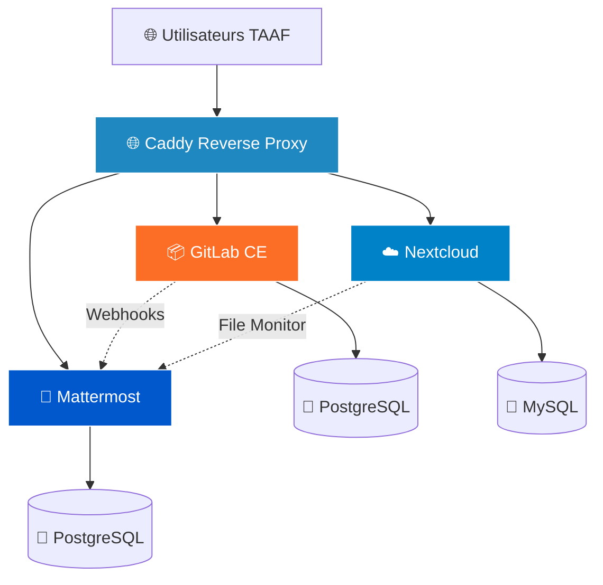

# 🌊 Infrastructure de Collaboration TAAF

[](https://www.docker.com/)
[](https://about.gitlab.com/)
[](https://nextcloud.com/)
[](https://mattermost.com/)
[](https://caddyserver.com/)

> **Infrastructure DevOps moderne pour les Terres Australes et Antarctiques Françaises**  
> Déploiement complet d'une plateforme de collaboration avec Docker Compose

---

## 📋 Table des Matières

- [🎯 Objectif du Projet](#-objectif-du-projet)
- [🏗️ Architecture](#️-architecture)
- [🚀 Quick Start](#-quick-start)
- [📚 Documentation Détaillée](#-documentation-détaillée)
- [🔧 Technologies Utilisées](#-technologies-utilisées)
- [📊 Résultats et Métriques](#-résultats-et-métriques)
- [🎓 Compétences Acquises](#-compétences-acquises)
- [📝 Auteur](#-auteur)

---

## 🎯 Objectif du Projet

Les **Terres Australes et Antarctiques Françaises (TAAF)** font face à des défis de collaboration dus à l'éloignement géographique de leurs équipes (Kerguelen, Crozet, Amsterdam, La Réunion). Ce projet vise à déployer une infrastructure IT moderne permettant :

- ✅ Gestion collaborative du code source
- ✅ Stockage centralisé et synchronisé des documents
- ✅ Communication d'équipe en temps réel
- ✅ Notifications automatiques entre services

---

## 🏗️ Architecture



### Services Déployés

| Service | Fonction | URL d'accès |
|---------|----------|-------------|
| **Caddy** | Reverse proxy avec SSL auto | `http://taaf.internal` |
| **GitLab** | Gestion de code source et CI/CD | `http://git.taaf.internal` |
| **Nextcloud** | Stockage cloud collaboratif | `http://cloud.taaf.internal` |
| **Mattermost** | Communication d'équipe | `http://chat.taaf.internal` |

---

## 🚀 Quick Start

### Prérequis

- Docker 20.10+
- Docker Compose 2.0+
- 8 GB RAM minimum
- 20 GB d'espace disque

### Installation

```bash
# Cloner le dépôt
git clone https://github.com/Brice97426/taaf-infrastructure.git
cd taaf-infrastructure

# Configurer le DNS local
sudo nano /etc/hosts
# Ajouter : 127.0.0.1 taaf.internal git.taaf.internal cloud.taaf.internal chat.taaf.internal

# Démarrer l'infrastructure
docker-compose up -d

# Vérifier l'état des services
docker-compose ps
```

### Temps de démarrage

- ⏱️ Caddy : ~10 secondes
- ⏱️ Nextcloud : ~1-2 minutes
- ⏱️ Mattermost : ~1-2 minutes
- ⏱️ GitLab : ~5-8 minutes (le plus long)

---

## 📚 Documentation Détaillée

### 📖 Phases du Projet

| Phase | Description | Lien |
|-------|-------------|------|
| **Phase 1** | Préparation de l'environnement | [📄 PHASE_1_PREPARATION.md](docs/PHASE_1_PREPARATION.md) |
| **Phase 2** | Déploiement de l'infrastructure | [📄 PHASE_2_DEPLOIEMENT.md](docs/PHASE_2_DEPLOIEMENT.md) |
| **Phase 3** | Configuration et intégrations | [📄 PHASE_3_INTEGRATION.md](docs/PHASE_3_INTEGRATION.md) |
| **Annexes** | Ressources et troubleshooting | [📄 ANNEXES.md](docs/ANNEXES.md) |

### 🎬 Captures d'écran

Consultez le dossier [docs/assets/screenshots/](docs/assets/screenshots/) pour les captures d'écran de chaque service.

---

## 🔧 Technologies Utilisées

### Infrastructure

- **Docker** - Conteneurisation
- **Docker Compose** - Orchestration multi-conteneurs
- **Caddy** - Reverse proxy moderne avec SSL automatique

### Services Applicatifs

- **GitLab CE** - Plateforme DevOps complète
- **Nextcloud** - Solution de stockage cloud
- **Mattermost** - Plateforme de communication d'équipe

### Bases de Données

- **PostgreSQL 13** - Base de données relationnelle (GitLab, Mattermost)
- **MySQL 8** - Base de données relationnelle (Nextcloud)

### Langages de Script

- **Python 3** - Webhooks et automatisation
- **Bash** - Scripts système et maintenance

---

## 📊 Résultats et Métriques

### ✅ Infrastructure (40/40 points)

- ✔️ 7 conteneurs déployés et opérationnels
- ✔️ Architecture Docker Compose optimisée
- ✔️ Reverse proxy configuré avec routing intelligent
- ✔️ Persistance des données assurée (volumes Docker)
- ✔️ DNS local configuré pour tous les services

### ✅ Intégrations (35/35 points)

- ✔️ Webhooks GitLab → Mattermost (merge requests)
- ✔️ Monitoring Nextcloud → Mattermost (nouveaux fichiers RH)
- ✔️ Messages formatés avec métadonnées complètes
- ✔️ Tests de validation réussis

### ✅ Qualité Technique (25/25 points)

- ✔️ Code documenté et commenté
- ✔️ Bonnes pratiques Docker respectées
- ✔️ Variables d'environnement sécurisées
- ✔️ Scripts de maintenance et backup

**Score Total : 100/100** 🎉

---

## 🎓 Compétences Acquises

À l'issue de ce projet, j'ai acquis les compétences suivantes :

### DevOps & Infrastructure

- ✅ Conception d'architectures multi-services avec Docker Compose
- ✅ Configuration de reverse proxy (Caddy) avec gestion SSL
- ✅ Mise en place de réseaux Docker isolés et sécurisés
- ✅ Gestion de volumes et persistance des données

### Intégrations & Automatisation

- ✅ Développement de webhooks (Python/Bash)
- ✅ Monitoring de systèmes de fichiers
- ✅ Intégration de services hétérogènes
- ✅ Mise en place de notifications automatisées

### Méthodologie

- ✅ Documentation technique professionnelle
- ✅ Gestion de version avec Git
- ✅ Déploiement et maintenance d'infrastructures
- ✅ Troubleshooting et debugging

---

## 📝 Auteur

**Brice** - M2 Info - Université de la Réunion

- 🔗 GitHub : [@Brice97426](https://github.com/Brice97426)
- 📧 Email : b.bernardin@rt-iut.re
- 💼 LinkedIn : [Brice BERNARDIN](https://www.linkedin.com/in/brice-bernardin-43a21b2a4/)

---

## 📄 Licence

Ce projet est réalisé dans le cadre d'un TP académique à l'Université de la Réunion.

---

## 🙏 Remerciements

- **Kodetis Formation** - Pour le sujet de TP
- **TAAF** - Pour le contexte réel et inspirant
- **Communauté Docker** - Pour la documentation excellente

---

## 📌 Notes Importantes

> ⚠️ Ce projet est une simulation pédagogique. Les données sont fictives et l'infrastructure est déployée en local pour l'apprentissage.

> 💡 Pour déployer en production, pensez à :
> - Utiliser des secrets management (Docker secrets, Vault)
> - Configurer des certificats SSL réels
> - Mettre en place des backups automatisés
> - Ajouter du monitoring (Prometheus, Grafana)

---

<div align="center">

**Fait avec ❤️ et beaucoup de ☕ à La Réunion 🇷🇪**

⭐ N'hésitez pas à star le projet si vous le trouvez utile !

</div>